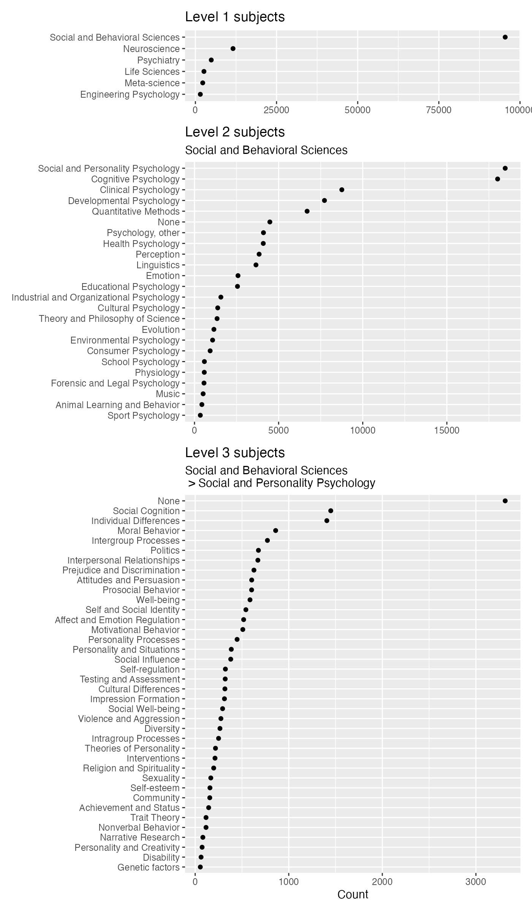

<!-- README.md is generated from README.qmd. Please edit that file -->

# psyarxivr

psyarxivr is an R package that provides access to
[PsyArXiv](https://osf.io/preprints/psyarxiv) preprint metadata within
R. The data is sourced from the [Open Science
Framework](https://osf.io/) API (via
<https://github.com/mvuorre/psyarxivdb>), and is updated monthly.

## Install

Install psyarxivr from [GitHub](https://github.com/mvuorre/psyarxivr):

``` r
# install.packages("pak")
pak::pkg_install("mvuorre/psyarxivr")
```

## Use

``` r
library(psyarxivr)
library(tidyverse) # Data wrangling
library(knitr) # Table display
```

The package provides a single table of preprint metadata called
`preprints`. Here’s what the data look like (see `?preprints`):

``` r
glimpse(preprints)
#> Rows: 50,179
#> Columns: 27
#> $ id                             <chr> "25pnr_v1", "266vp_v1", "27b43_v1", "2q…
#> $ title                          <chr> "Adapting a Revised Child Anxiety and D…
#> $ description                    <chr> "*Abstract. *Education is an important …
#> $ date_created                   <dttm> 2016-08-29 18:54:36, 2016-12-14 13:53:…
#> $ date_modified                  <dttm> 2018-07-02 10:45:06, 2018-07-02 10:45:…
#> $ date_published                 <dttm> 2016-08-29 18:54:36, 2016-12-14 14:49:…
#> $ original_publication_date      <dttm> NA, NA, NA, NA, NA, NA, 2014-12-31 13:…
#> $ publication_doi                <chr> NA, NA, NA, NA, NA, NA, "https://doi.or…
#> $ preprint_doi                   <chr> "https://doi.org/10.31234/osf.io/25pnr"…
#> $ download_url                   <chr> "https://osf.io/download/57c484ed594d90…
#> $ license                        <chr> NA, "CC0 1.0 Universal", "CC0 1.0 Unive…
#> $ is_published                   <dbl> 1, 1, 1, 1, 1, 1, 1, 1, 1, 1, 1, 1, 1, …
#> $ reviews_state                  <chr> "accepted", "accepted", "accepted", "ac…
#> $ version                        <dbl> 1, 1, 1, 1, 1, 1, 1, 1, 1, 1, 1, 1, 1, …
#> $ is_latest_version              <dbl> 1, 1, 1, 1, 1, 1, 1, 1, 1, 1, 1, 1, 1, …
#> $ has_coi                        <dbl> 0, 0, 0, 0, 0, 0, 0, 0, 0, 0, 0, 0, 0, …
#> $ conflict_of_interest_statement <chr> NA, NA, NA, NA, NA, NA, NA, NA, NA, NA,…
#> $ has_data_links                 <chr> NA, NA, NA, NA, NA, NA, NA, NA, NA, NA,…
#> $ why_no_data                    <chr> NA, NA, NA, NA, NA, NA, NA, NA, NA, NA,…
#> $ data_links                     <chr> "null", "null", "null", "null", "null",…
#> $ has_prereg_links               <chr> NA, NA, NA, NA, NA, NA, NA, NA, NA, NA,…
#> $ why_no_prereg                  <chr> NA, NA, NA, NA, NA, NA, NA, NA, NA, NA,…
#> $ prereg_links                   <chr> "null", "null", "null", "null", "null",…
#> $ prereg_link_info               <chr> NA, NA, NA, NA, NA, NA, NA, NA, NA, NA,…
#> $ contributors                   <chr> "[{\"full_name\": \"Kasturi Haldar\", \…
#> $ subjects                       <chr> "[[{\"id\": \"5b4e7425c6983001430b6c1e\…
#> $ tags                           <chr> "[\"Preprint\", \"psyarxiv\"]", "[\"awa…
```

### Example: Preprints over time

As an example, we tabulate the number of preprints created per year.

``` r
preprints |>
  mutate(
    year = floor_date(date_created, unit = "year") |> str_sub(1, 4)
  ) |>
  count(year) |>
  pivot_wider(names_from = year, values_from = n) |>
  kable()
```

<div id="tbl-year">

Table 1: Yearly new PsyArXiv preprints.

<div class="cell-output-display">

| 2016 | 2017 | 2018 | 2019 | 2020 | 2021 | 2022 | 2023 | 2024 |  2025 |
|-----:|-----:|-----:|-----:|-----:|-----:|-----:|-----:|-----:|------:|
|  187 |  992 | 2354 | 3583 | 6229 | 6704 | 6291 | 6717 | 6688 | 10434 |

</div>

</div>

## Data structure

See `?preprints` for details on the variables. Below, I explain the
three JSON variables `contributors`, `subjects`, and `tags`, with
examples on how to work with them.

### Contributors

The `contributors` variable contains a JSON array of preprints’ authors.
In R, this data structure is perhaps easiest to work with as tables
inside a
[list-column](https://r4ds.hadley.nz/rectangling.html#list-columns),
which can then be
[unnested](https://tidyr.tidyverse.org/reference/unnest.html):

``` r
library(jsonlite)
#> 
#> Attaching package: 'jsonlite'
#> The following object is masked from 'package:purrr':
#> 
#>     flatten

preprints |>
  select(id, contributors) |>
  slice_sample(n = 2) |>
  mutate(
    contributors = map(contributors, fromJSON)
  ) |>
  unnest(contributors)
#> # A tibble: 3 × 5
#>   id       full_name                      date_registered    index bibliographic
#>   <chr>    <chr>                          <chr>              <int> <lgl>        
#> 1 8ec5r_v1 Joaquin Matias Alfei Palloni   2016-01-20T13:36:…     0 TRUE         
#> 2 em29z_v1 Catherine Pressimone Beckowski 2024-04-04T23:54:…     0 TRUE         
#> 3 em29z_v1 Benjamin M. Torsney            2019-11-03T15:17:…     1 TRUE
```

These data allow rich analyses of, for example, coauthor networks.

### Subjects

The `subjects` variable is a JSON array of arrays. This data format
directly follows from the [OSF
API](https://developer.osf.io/#tag/Preprints). In R, the JSON is
converted into a list of data frames, where each indicates a hierarchy
such as “Social and Behavioral Sciences \> Social and Personality
Psychology”. The first row in each data frame indicates the top-level
OSF subject, and the bottom row the smallest sub-category. Thus, the
top-level categories can be duplicated for each preprint. For example:

``` r
fromJSON(preprints$subjects[[1]])
#> [[1]]
#>                         id                              text
#> 1 5b4e7425c6983001430b6c1e    Social and Behavioral Sciences
#> 2 5b4e7425c6983001430b6c34 Social and Personality Psychology
#> 
#> [[2]]
#>                         id                           text
#> 1 5b4e7425c6983001430b6c1e Social and Behavioral Sciences
#> 2 5b4e7426c6983001430b6c45              Psychology, other
```

One way to flatten this variable is to create a wide-format table of
subjects at different levels (the maximum at PsyArXiv is three) for each
preprint:

``` r
# Table with a list column of lists of subject tables
subjects <- preprints |>
  select(preprint = id, subjects) |>
  mutate(
    subjects_list = map(subjects, ~ fromJSON(.x)),
    preprint_row = row_number()
  ) |>
  select(-subjects)

# Unnest all subjects from all preprints with indices
subjects <- subjects |>
  unnest(subjects_list) |>
  mutate(subject_index = row_number(), .by = c(preprint, preprint_row)) |>
  unnest(subjects_list) |>
  mutate(level = row_number(), .by = c(preprint, subject_index))

# Pivot to wide format so each preprint-subject has a unique row
subjects <- subjects |>
  select(preprint, subject_index, level, text) |>
  pivot_wider(
    names_from = level,
    values_from = text,
    names_prefix = "level_"
  )
```

This is becoming somewhat abstract, so a plot of category counts might
illustrate. Read the code below at your own peril.

``` r
set.seed(999)
library(patchwork)
subjects_count <- subjects |>
  count(level_1, level_2, level_3, sort = TRUE) |>
  mutate(
    level_2 = replace_na(level_2, "None"),
    level_3 = replace_na(level_3, "None")
  )
p1 <- subjects_count |>
  summarise(n = sum(n), .by = level_1) |>
  mutate(level_1 = fct_reorder(level_1, n)) |>
  ggplot(aes(n, level_1)) +
  geom_point() +
  labs(title = "Level 1 subjects")

p2 <- subjects_count |>
  filter(level_1 == "Social and Behavioral Sciences") |>
  summarise(n = sum(n), .by = level_2) |>
  mutate(level_2 = fct_reorder(level_2, n)) |>
  ggplot(aes(n, level_2)) +
  geom_point() +
  labs(
    title = "Level 2 subjects",
    subtitle = "Social and Behavioral Sciences"
  )

p3 <- subjects_count |>
  filter(
    level_1 == "Social and Behavioral Sciences",
    level_2 == "Social and Personality Psychology"
  ) |>
  summarise(n = sum(n), .by = level_3) |>
  mutate(level_3 = fct_reorder(level_3, n)) |>
  ggplot(aes(n, level_3)) +
  geom_point() +
  labs(
    title = "Level 3 subjects",
    subtitle = "Social and Behavioral Sciences\n > Social and Personality Psychology"
  )

(p1 / p2 / p3) +
  plot_layout(heights = c(12, 44, 64), axes = "collect") &
  scale_x_continuous("Count") &
  theme(axis.title.y = element_blank())
```



# Development

To update the data while keeping repo size small:

1.  Remove data file from git history:
    `git filter-repo --path data/preprints.rda --invert-paths --force`
2.  Clean up git storage:
    `git reflog expire --expire=now --all && git gc --prune=now --aggressive`
3.  Remove LFS objects (if any): `git lfs prune --force`
4.  Add updated data and commit normally
